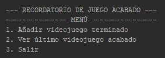
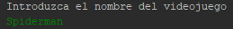
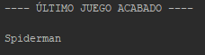

<h1> Ultimo-Videojuego </h1>
<h3> Descripción </h3> 

Programa muy simple que nos permite a través de la consola recordar cuál fue el último videojuego que nos acabamos.

<h3> Menú </h3> 

Lo primero que nos aparecerá será un menú de selección en el que podremos elegir 3 opciones en nuestro recordatorio.  
· Añadir último videojuego terminado.  
· Ver último videjuego acabado.  
· Salir.   

<h3> Añadir </h3> 

Eligiendo la opción nº1 nos aparecerá la opción de añadir el último videojuego terminado, simplemente escribimos el nombre del videojuego y se añadirá a nuestro recordatorio.  

<h3> Visualizar </h3> 

La opción nº2 nos mostrará en nombre del videojuego que hayamos introducido anteriormente por teclado. Como ya dije con anterioridad es un programa muy simple y por lo tanto si añadimos en la opción nº1 otro videojuego, nos aparecerá ese último videojuego introducido.  

