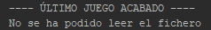
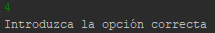

<h1> Último-Videojuego </h1>
<h3> Descripción </h3> 

Programa muy simple que nos permite a través de la consola recordar cuál fue el último videojuego que nos acabamos.

<h3> Menú </h3> 

Lo primero que nos aparecerá será un menú de selección en el que podremos elegir 3 opciones en nuestro recordatorio.  
· Añadir último videojuego terminado.  
· Ver último videjuego acabado.  
· Salir.   

<h3> Añadir </h3> 

Eligiendo la opción nº1 nos aparecerá la opción de añadir el último videojuego terminado, simplemente escribimos el nombre del videojuego y se añadirá a nuestro recordatorio.   

<h3> Visualizar </h3> 

La opción nº2 nos mostrará en nombre del videojuego que hayamos introducido anteriormente por teclado. Como ya dije con anterioridad es un programa muy simple y por lo tanto si añadimos en la opción nº1 otro videojuego, nos aparecerá ese último videojuego introducido.   

<h3> Errores </h3> 

Uno de los problemas que nos podemos encontrar en la aplicación es que no nos muestre el nombre del videojuego que hemos introducido por teclado, ya sea porque no ha encontrado el fichero ó porque no es capaz de leer el fichero.   

Otro de los errores que nos puede aparecer es al introducir una de las opciones del menú, en este caso he introducido "4" y directamente el programa te da el error de que la opción introducida no es la correcta.

